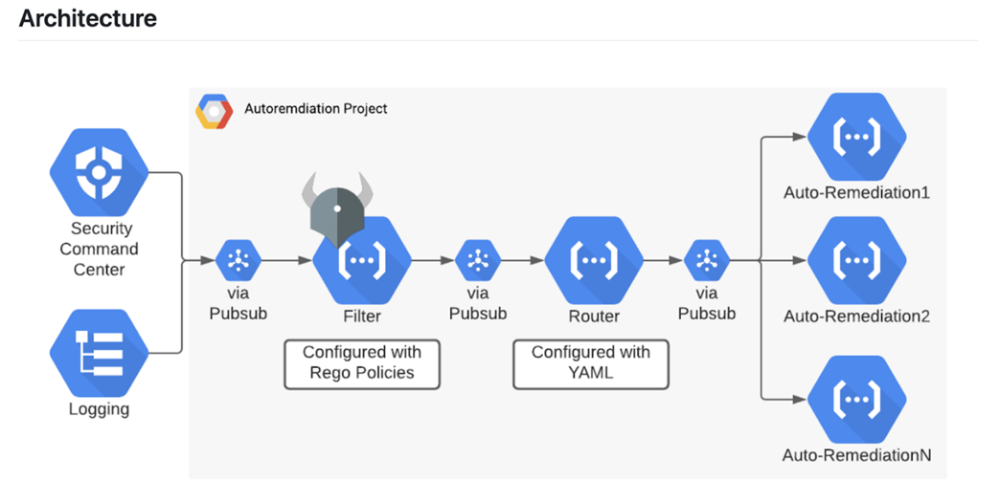

# Security Automation Terraform Project

This Terraform project automates the setup and configuration of security-related resources on Google Cloud Platform (GCP). The project includes configurations for network setup, firewall rules, multi-factor authentication (MFA), Identity Platform, and IAM policies.

## Prerequisites
- [Terraform](https://www.terraform.io/) installed locally.
- Appropriate access and permissions to create resources in GCP.

## Terraform Providers

### Provider Configuration

The `provider.tf` file specifies the GCP provider configuration:

```
provider "google" {
  project = "security-automation"
  region  = "us-central1"
  zone    = "us-central1-c"
}

```

## Network Configuration
### Firewall Rule and Network
The `network.tf` file defines a Google Compute Engine firewall rule and a network:

```
    resource "google_compute_firewall" "security-automation-fw" {
    # Firewall rule configuration...
    }

    resource "google_compute_network" "security-automation-network" {
    # Network configuration...
    }
```

`google_compute_firewall`: Defines a firewall rule allowing specified traffic.
`google_compute_network`: Creates a network named "security-automation-network."

## Internal Network Configuration
### Internal Network Firewall Rule

The `net_monitor.tf` file defines another Google Compute Engine network and a firewall rule for internal traffic:

```
    resource "google_compute_network" "internal_network" {
    # Internal network configuration...
    }

    resource "google_compute_firewall" "internal_firewall" {
    # Firewall rule for internal traffic...
    }

```

`google_compute_network`: Creates an internal network named "internal-network."
`google_compute_firewall`: Defines a firewall rule allowing internal traffic.

## Multi-Factor Authentication (MFA)

### GCP Project and Identity Toolkit Configuration
The `mfa.tf` file creates a GCP project, enables the Identity Toolkit API, and configures Identity Platform settings:

```
    resource "google_project" "security-automation" {
    # Project configuration...
    }

    resource "google_project_service" "identitytoolkit" {
    # Enables Identity Toolkit API...
    }

    resource "google_identity_platform_config" "default" {
    # Identity Platform configuration...
    }
```

`google_project`: Creates a GCP project with specified details.
`google_project_service`: Enables the Identity Toolkit API.
`google_identity_platform_config`: Configures Identity Platform settings.

## IAM Policies
### IAM Policies Overview

This section outlines the IAM policies configured for the GCP project:

`google_project_iam_policy`: Sets the IAM policy for the project.
`data "google_iam_policy"`: Retrieves the IAM policy for a specific role.
`google_project_iam_binding`: Adds additional members to a role.

The `iam.tf` file defines IAM policies for the GCP project:

```
    resource "google_project_iam_policy" "security-automation-iam" {
    # IAM policy for the project...
    }

    data "google_iam_policy" "admin" {
    # Data source to retrieve IAM policy...
    }

    resource "google_project_iam_binding" "prevent_privilege_escalation" {
    # Additional IAM binding for editor role...
    }

    resource "google_project_iam_policy" "security-automation-iam-external" {
    # IAM policy with conditions for limited-time users...
    }

    data "google_iam_policy" "external-users" {
    # Data source for IAM policy with conditions...
    }
```


### Task details:

•	A data science company I work for has all of its workloads running on one major cloud provider platform. The company uses cloud-managed services only, including a mixture of virtual machines and containers, databases, caches, and object storage.
•	The company employs junior and senior developers and SREs, and deployments of code, as well as infrastructure, are automated as code. Only very few users should have administrative privileges on the cloud platform. Furthermore, the company’s cloud resources under my purview are meant to be internal only; there are no services meant to be exposed to the public.
•	As a senior cloud security engineer, I was tasked with creating a system of continuous monitoring and automated remediations that cover but are not limited to the following cases:
o	Identity and Access Management changes that result in privilege escalation (note: think about both users and service accounts, both internal and ones belonging to external services).
o	Creating or modifying resources that are exposed to the public internet.
o	Users having no MFA on their accounts.
o	Changes made to internal networking settings.



### Architecture points: 

1.	A finding is either generated from Security Command Center (and can also use Cloud Logging) and sent to a Pubsub topic
2.	The Filter Cloud Function first can optionally run the finding through a series of Rego policies ( defined policies)  that will automatically mark the finding as a false positive and auto-close it.
3.	If the finding isn’t valid for your environment, it is sent to the Router Function, which is configured by YAML to send the finding on to the correct auto-remediation function that you have enabled.
4.	The auto-remediation Cloud Functions then take action to fix the problem addressed with the finding.


### Identity and Access Management (IAM) Escalation:

### Use Case:
A user accidentally grants excessive permissions to another user or service account, creating a privilege escalation risk.

### Automated Remediation:

- Script: Utilize a script that continuously monitors IAM events for specific actions like granting admin privileges. Upon detection, automatically revoke the excessive permissions and notify administrators.
- Cron job: Create a cron job that runs the script at regular intervals.
- Justification: Scripting allows for immediate mitigation of privilege escalation attempts, minimizing potential damage.

### Exposed Public Resources:

### Use Case:

A new resource is provisioned without proper security configurations, exposing it to the public internet.

### Automated Remediation:

- Terraform: Define templates with pre-configured security settings for common resource types. When a new resource is created, automatically deploy the associated template to enforce secure configurations.
- Justification: Templates ensure consistent security across all resources, preventing accidental misconfigurations.

### Missing Multi-Factor Authentication (MFA):

### Use Case:

Users haven't enabled MFA on their accounts, increasing the risk of unauthorized access.

### Conditional Access Policies:
Implement policies requiring MFA for all login attempts based on specific conditions like geographical location or login attempt time.
- Justification: Conditional access policies enforce MFA without impacting legitimate user access, improving security without unnecessary friction.

### Internal Network Changes:

### Use Case:
Unauthorized or risky changes are made to internal network configurations, potentially compromising security.

- Network Change Detection Tools: Deploy tools that monitor network configurations and alert on unauthorized changes. Additionally, leverage rollback functionalities to revert to previous configurations if needed.
- Justification: Monitoring and rollback capabilities ensure rapid detection and mitigation of risky network changes.

### Custom Remediation Example:

### Scenario:
A service account used for database backups accidentally acquires excessive permissions in IAM.

### Custom Script:
Develop a script that identifies service accounts with specific IAM roles, for example `iamcheck.py`, and limits permissions to predefined levels. Schedule regular execution of the script to maintain secure configurations.

Justification: This custom script addresses a specific risk not covered by other tools, ensuring service accounts operate with least privilege.